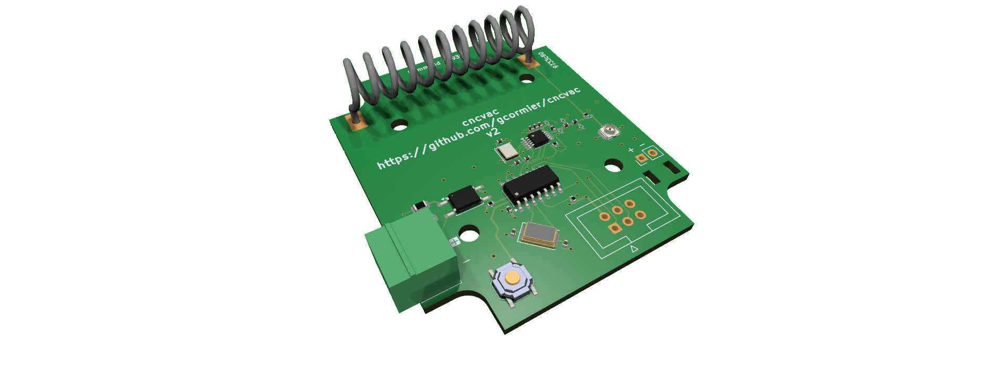

# cncvac

This is a 433MHz ASK/FSK transmitter controlled by an ATTINY841.

It runs off regular AA/AAA batteries and can be used to control various devices like garage doors, gates, etc. The intent was to have it control my dust collection system in the shop which is using the iVac Pro system. The iVac Pro system is a great system but it is expensive and I wanted to have a cheaper alternative to control it, and the company did not offer a remote control that could be triggered from a logic signal. (They now sell one)

It has an opto-isolated input controlled by a 5-24V logic signal.

### Case
This fits in a [Hammond 1593P case](https://www.digikey.ca/en/products/detail/hammond-manufacturing/1593PBK/270098) and can use their [battery holder](https://www.digikey.ca/en/products/detail/hammond-manufacturing/BH3AAAW/3869833) as well.

### Power Consumption
#### Transmitting
1mV = 1uA
1-3mA while transmitting

#### Sleep/Idle
1mV = 1nA
Better than 1.2uA while sleeping
Based on the average capacity of two AA NiMH batteries, 2000mAh, this should last almost 200 years.
